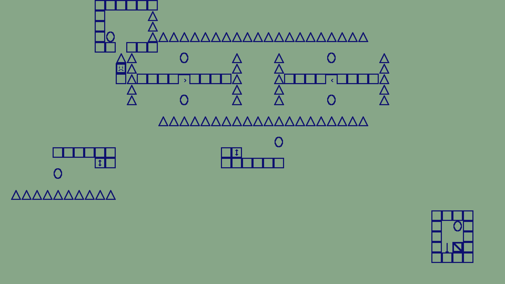

# Box

A game wherein you are a box.



It was made for [this game jam](https://itch.io/jam/anything-goes-jam-8-bits-to-infinity).

## Controls, etc.

f - enter fullscreen mode.  
Escape - go back.  
r - restart a level.  
p - pause  
\- (minus) - slow down the game  
= (equals) - Speed up the game


You are a box. You can click on portals to teleport to them.  
If you hit an enemy from the side, you will die. If you hit an enemy from above, it will.

### Level editor controls

When you are placing something, clicking on a tile will place that thing on that tile. When you aren't placing anything, clicking on a tile will erase whatever's there.

b - Place the box (make sure you do this at some point!)  
e - Place an enemy  
s - Place a spike  
l - Place a leftwards-moving conveyor belt.  
r - Place a rightwards-moving conveyor belt.  
p - Place a portal.  
g - Place the goal.  
w - Place a wall.  
1 - Place a gravity flip powerup.  
2 - Place a strength powerup.  
3 - Place a pause enemies powerup.  

Escape - If you are placing something, you will stop placing that thing.

When you open/save, it will ask you for a name for the level in the console.  
Ctrl+O - Open  
Ctrl+S - Save  
Ctrl+Shift+S - Save as

When you have created a level, you can add it to the game by adding its name to the file `game_levels/listing.txt`.

## Building on Linux
You can download the dependencies, download it, and run it with (on Debian/Ubuntu)
```bash
sudo apt install libsdl2-dev libsdl2-mixer-dev
go get github.com/veandco/go-sdl2
go get github.com/pommicket/box
cd $GOPATH/src/github.com/pommicket/box
go run main.go
```
Or build it with `go build`.

You can also cross-compile it for Windows using the `compile.sh` script.

## Building on Windows
Good luck!

## About

This game was created using the [Go programming language](https://golang.org) and [SDL](https://www.libsdl.org/), specifically [these Go bindings for SDL](https://github.com/veandco/go-sdl2/).

## Licenses

The code itself is licensed under the GNU General Public License, version 3.0, as per the `LICENSE` file.

All the sprites (files in the `sprites` directory) are licensed under the [Creative Commons 0 License](https://creativecommons.org/share-your-work/public-domain/cc0/):
<p xmlns:dct="http://purl.org/dc/terms/" xmlns:vcard="http://www.w3.org/2001/vcard-rdf/3.0#">
  <a rel="license"
     href="http://creativecommons.org/publicdomain/zero/1.0/">
    
  </a>
  <br />
  To the extent possible under law,
  <a rel="dct:publisher"
     href="https://pommicket.com">
    <span property="dct:title">Leo Tenenbaum</span></a>
  has waived all copyright and related or neighboring rights to
  <span property="dct:title">Box Sprites</span>.
This work is published from:
<span property="vcard:Country" datatype="dct:ISO3166"
      content="CA" about="https://pommicket.com">
  Canada</span>.
</p>

<a rel="license" href="http://creativecommons.org/licenses/by-sa/4.0/"></a><br />The music for *Box* (`audio/music.ogg`) is licensed under a <a rel="license" href="http://creativecommons.org/licenses/by-sa/4.0/">Creative Commons Attribution-ShareAlike 4.0 International License</a>.

## Credits

The music (`audio/music.ogg`) is a co-production of me, Leo Tenenbaum, and Alex Tenenbaum.

Also, thanks to https://github.com/veandco for their Go SDL2 bindings.

## Issues

There may be bugs...
In fact, there probably are.
You can add a bug as an [issue](https://github.com/pommicket/box/issues) (but I might not get around to fixing it...), or better yet, if you can fix it, submit a pull request.
